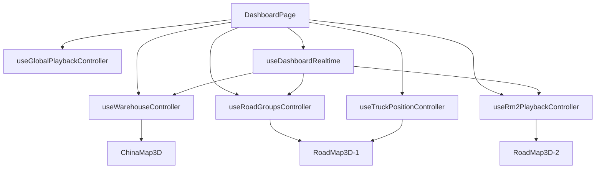

# 聚申数字孪生前端技术文档

> 更新日期：2026-08-11
>
> 适用分支：`main`

## 1. 架构

`DashboardPage` 是页面编排层，不直接实现 Three.js 细节。它组合数据控制器、播放控制器、三维模块和侧面板。



边界约定：

- `hooks/` 管业务状态和副作用。
- `modules/` 管渲染、Three.js 对象和图表。
- `services/` 管 HTTP、鉴权、DTO 归一化。
- `playback/` 管纯状态机、路线身份和组推进算法。
- 组件不直接拼接后端 URL，也不重新计算后端分组。

## 2. 视图与全局播放

`ViewMode` 当前只有：

- `chinaMap`：全国仓库和城市聚焦。
- `roadMap`：RM1 路线组。
- `roadMap2`：RM2 稳定分组和复合行程。

全局链：

```text
ChinaMap -> RM1_Judge -> RM1 -> RM2_Judge -> RM2 -> End -> ChinaMap
```

`useGlobalPlaybackController` 负责：

- ChinaMap 循环次数和全局总循环次数。
- 进入 RM1/RM2 前的数据判定。
- 视图冷却期，防止刚切换就误判为空。
- RM1/RM2 耗尽后的推进。
- 手动直达时同步当前链节点。

`LABEL_CONFIG.globalPlayback` 是唯一播放配置入口。视图按钮和组按钮只控制人工入口的可见性，不应改变自动播放。

## 3. RM1

`useRoadGroupsController` 调用 `roadApi.ts` 获取分组，维护活动组和分组策略。加载组后将路线交给 `useTruckPositionController` 和 `RoadMap3D-1`。

关键行为：

- 每个组完成后推进下一个组。
- 只剩一个组时必须完整展示后再通知全局链。
- 切换策略会重置活动组、场景路线和完成集合。
- `road_path` 是路径增量，进入视图仍需主动拉取组快照。

## 4. RM2

`useRm2PlaybackController` 使用三个接口：结构、组列表、组路线。拓扑通过 `snapshotVersion` 保持原子一致性。

数据流：

1. 拉取省、方向、组结构。
2. 构建播放链并选择活动组。
3. 拉取活动组路线和车辆位置。
4. `rm2SceneAdapter` 将 DTO 转为 Three.js 场景输入。
5. `vehicle_positions(scope=rm2)` 只更新位置，不重建拓扑。
6. `route_snapshot_changed` 经防抖后刷新变化组。

身份必须区分：

- `lineId`：后端线路实例。
- `businessLineId`：业务线路原子单元。
- `tripId`：复合行程。
- `sceneRouteId`：场景对象 ID。
- `visualKey`：视觉稳定键。

不得用数组下标或车牌作为唯一场景 ID。

## 5. 车辆位置与路径投影

`useTruckPositionController` 维护最新样本、活动路线、已完成路线和渲染节拍。处理顺序：

1. 丢弃旧时间戳样本。
2. 把坐标投影到路线附近的可信窗口。
3. 对短时无样本区间做有限死推。
4. 在渲染 tick 中插值移动，不直接瞬移模型。
5. 到达终点后通知对应组控制器。

U 形或重叠路线不能只做全局最近点投影，否则车辆可能跳到另一段。窗口必须围绕上一进度向前搜索，并限制倒退。

## 6. 三维模块

### ChinaMap3D

负责行政区地图、仓库标签、城市升降、仓库巡游和聚焦图表。城市详情来自 `warehouse_focus`，布局规格来自后端 `warehouse.yml`。

### RoadMap3D-1 / RoadMap3D-2

两个模块共享视觉工具，但业务控制器独立。场景层包括：

- 行政区填充和边界。
- 路线底管、辉光线、共享路段和方向提示。
- 起点、终点、装卸节点与避让标签。
- GLB 卡车、选中态和报警波纹。

Three.js 对象必须通过各模块的 refs 和 handle 管理，并在 effect 清理时释放 geometry、material、texture、animation frame 和 timer。

## 7. 颜色、标签和复合订单

- 路线颜色由稳定业务键决定，不能随接口返回顺序变化。
- 同一业务线路多车保持同色，不同订单尽量使用不同色槽。
- 共享路段可视觉合并，但每条业务路线仍保留独立身份和进度。
- `tripStops` 是面板里程碑和地图节点的唯一顺序来源。
- 标签避让只改变屏幕偏移，不改变真实地图坐标。

视觉通用逻辑位于 `routeVisuals.ts`、`routePresentation.ts` 和 `vehicleAlertRipples.ts`，不要在两个 RoadMap 模块重复实现。

## 8. 实时连接与鉴权

`dashboardAuth.ts` 管理会话签发、校验、刷新和请求头。`dashboardFetch` 是受保护 REST 的统一入口。

`useDashboardRealtime` 负责：

- WebSocket 建连和指数退避重连。
- 应用层 `ping/pong`。
- 会话刷新后的重新连接。
- 按当前视图发送 `vehicle_position_subscription`。
- 将消息分派到仓库、RM1、RM2 和 KPI 控制器。

重连成功后必须重新拉取快照。WebSocket 消息可能重复、延迟或乱序，所有位置和快照处理都要幂等。

## 9. 服务层

| 文件 | 责任 |
|---|---|
| `dashboardAuth.ts` | 会话和统一请求 |
| `bootstrapApi.ts` | 启动与验证状态 |
| `roadApi.ts` | RM1、派发和分组 |
| `renderRouteApi.ts` | RM2 DTO、结构和路线 |
| `warehouseApi.ts` | 仓储快照与聚焦 |
| `mapGeoApi.ts` | 行政区数据 |
| `dashboardKpi.ts` | KPI 快照与事件 |

DTO 兼容和字段默认值应在服务层处理，渲染组件接收稳定类型。

## 10. 测试

当前重点测试：

- 全局链和 RM1 单组推进。
- RM2 路线身份和场景适配。
- 路线视觉、颜色、共享进度和标签布局。
- Dashboard 常量与播放配置。

命令：

```powershell
npm run lint
npm test
npm run build
```

修改播放状态机、路线身份、位置投影或共享视觉工具时必须补纯函数测试。三维交互变更还需在 ChinaMap、RM1 和 RM2 视图做人工冒烟。

## 11. 开发注意事项

- 不在 `DashboardPage` 增加大块算法，提取到 hook、service 或 playback。
- 不把业务数据复制到多个 state/ref；明确唯一所有者。
- 不在 render 期间创建 Three.js 对象或网络请求。
- 不提交 `.env`、`dist/`、截图、临时验证文件或 `*.tsbuildinfo`。
- 删除旧实现时同步删除备份源码，禁止保留 `*-used.tsx` 一类可被编译器扫描的副本。
- 前后端字段或消息协议变化时，同时更新根技术文档和后端技术文档。
