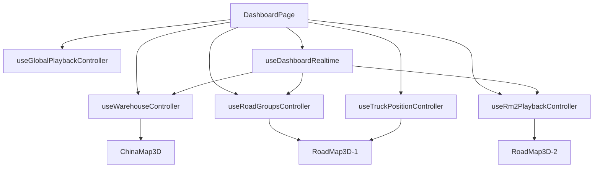

# 聚申数字孪生前端技术文档

> 更新日期：2026-08-11
>
> 适用分支：`main`

## 1. 架构

`DashboardPage` 是页面编排层，不直接实现 Three.js 细节。它组合数据控制器、播放控制器、三维模块和侧面板。



边界约定：

- `hooks/` 管业务状态和副作用。
- `modules/` 管渲染、Three.js 对象和图表。
- `services/` 管 HTTP、鉴权、DTO 归一化。
- `playback/` 管纯状态机、路线身份和组推进算法。
- 组件不直接拼接后端 URL，也不重新计算后端分组。

## 2. 视图与全局播放

`ViewMode` 当前只有：

- `chinaMap`：全国仓库和城市聚焦。
- `roadMap`：RM1 路线组。
- `roadMap2`：RM2 稳定分组和复合行程。

全局链：

```text
ChinaMap -> RM1_Judge -> RM1 -> RM2_Judge -> RM2 -> End -> ChinaMap
```

`useGlobalPlaybackController` 负责：

- ChinaMap 循环次数和全局总循环次数。
- 进入 RM1/RM2 前的数据判定。
- 视图冷却期，防止刚切换就误判为空。
- RM1/RM2 耗尽后的推进。
- 手动直达时同步当前链节点。

`LABEL_CONFIG.globalPlayback` 是唯一播放配置入口。视图按钮和组按钮只控制人工入口的可见性，不应改变自动播放。

## 3. RM1

`useRoadGroupsController` 调用 `roadApi.ts` 获取分组，维护活动组和分组策略。加载组后将路线交给 `useTruckPositionController` 和 `RoadMap3D-1`。

关键行为：

- 每个组完成后推进下一个组。
- 只剩一个组时必须完整展示后再通知全局链。
- 切换策略会重置活动组、场景路线和完成集合。
- `road_path` 是路径增量，进入视图仍需主动拉取组快照。

## 4. RM2

`useRm2PlaybackController` 使用三个接口：结构、组列表、组路线。拓扑通过 `snapshotVersion` 保持原子一致性。

数据流：

1. 拉取省、方向、组结构。
2. 构建播放链并选择活动组。
3. 拉取活动组路线和车辆位置。
4. `rm2SceneAdapter` 将 DTO 转为 Three.js 场景输入。
5. `vehicle_positions(scope=rm2)` 只更新位置，不重建拓扑。
6. `route_snapshot_changed` 经防抖后刷新变化组。

身份必须区分：

- `lineId`：后端线路实例。
- `businessLineId`：业务线路原子单元。
- `tripId`：复合行程。
- `sceneRouteId`：场景对象 ID。
- `visualKey`：视觉稳定键。

不得用数组下标或车牌作为唯一场景 ID。

## 5. 车辆位置与路径投影

`useTruckPositionController` 维护最新样本、活动路线、已完成路线和渲染节拍。处理顺序：

1. 丢弃旧时间戳样本。
2. 把坐标投影到路线附近的可信窗口。
3. 对短时无样本区间做有限死推。
4. 在渲染 tick 中插值移动，不直接瞬移模型。
5. 到达终点后通知对应组控制器。

U 形或重叠路线不能只做全局最近点投影，否则车辆可能跳到另一段。窗口必须围绕上一进度向前搜索，并限制倒退。

## 6. 三维模块

### ChinaMap3D

负责行政区地图、仓库标签、城市升降、仓库巡游和聚焦图表。城市详情来自 `warehouse_focus`，布局规格来自后端 `warehouse.yml`。

### RoadMap3D-1 / RoadMap3D-2

两个模块共享视觉工具，但业务控制器独立。场景层包括：

- 行政区填充和边界。
- 路线底管、辉光线、共享路段和方向提示。
- 起点、终点、装卸节点与避让标签。
- GLB 卡车、选中态和报警波纹。

Three.js 对象必须通过各模块的 refs 和 handle 管理，并在 effect 清理时释放 geometry、material、texture、animation frame 和 timer。

## 7. 颜色、标签和复合订单

- 路线颜色由稳定业务键决定，不能随接口返回顺序变化。
- 同一业务线路多车保持同色，不同订单尽量使用不同色槽。
- 共享路段可视觉合并，但每条业务路线仍保留独立身份和进度。
- `tripStops` 是面板里程碑和地图节点的唯一顺序来源。
- 标签避让只改变屏幕偏移，不改变真实地图坐标。

视觉通用逻辑位于 `routeVisuals.ts`、`routePresentation.ts` 和 `vehicleAlertRipples.ts`，不要在两个 RoadMap 模块重复实现。

## 8. 实时连接与鉴权

`dashboardAuth.ts` 管理会话签发、校验、刷新和请求头。`dashboardFetch` 是受保护 REST 的统一入口。

`useDashboardRealtime` 负责：

- WebSocket 建连和指数退避重连。
- 应用层 `ping/pong`。
- 会话刷新后的重新连接。
- 按当前视图发送 `vehicle_position_subscription`。
- 将消息分派到仓库、RM1、RM2 和 KPI 控制器。

重连成功后必须重新拉取快照。WebSocket 消息可能重复、延迟或乱序，所有位置和快照处理都要幂等。

## 9. 服务层

| 文件 | 责任 |
|---|---|
| `dashboardAuth.ts` | 会话和统一请求 |
| `bootstrapApi.ts` | 启动与验证状态 |
| `roadApi.ts` | RM1、派发和分组 |
| `renderRouteApi.ts` | RM2 DTO、结构和路线 |
| `warehouseApi.ts` | 仓储快照与聚焦 |
| `mapGeoApi.ts` | 行政区数据 |
| `dashboardKpi.ts` | KPI 快照与事件 |

DTO 兼容和字段默认值应在服务层处理，渲染组件接收稳定类型。

## 10. 测试

当前重点测试：

- 全局链和 RM1 单组推进。
- RM2 路线身份和场景适配。
- 路线视觉、颜色、共享进度和标签布局。
- Dashboard 常量与播放配置。

命令：

```powershell
npm run lint
npm test
npm run build
```

修改播放状态机、路线身份、位置投影或共享视觉工具时必须补纯函数测试。三维交互变更还需在 ChinaMap、RM1 和 RM2 视图做人工冒烟。

## 11. 开发注意事项

- 不在 `DashboardPage` 增加大块算法，提取到 hook、service 或 playback。
- 不把业务数据复制到多个 state/ref；明确唯一所有者。
- 不在 render 期间创建 Three.js 对象或网络请求。
- 不提交 `.env`、`dist/`、截图、临时验证文件或 `*.tsbuildinfo`。
- 删除旧实现时同步删除备份源码，禁止保留 `*-used.tsx` 一类可被编译器扫描的副本。
- 前后端字段或消息协议变化时，同时更新根技术文档和后端技术文档。

## 12. 页面编排与状态所有权

`DashboardPage.tsx` 只负责装配。当前关键状态所有权如下，改动前先找到唯一所有者，禁止再复制一份同义 state：

| 状态 | 所有者 | 消费方 |
|---|---|---|
| `currentView` | `DashboardPage` | 三个视图、全局播放、实时订阅 |
| 仓库快照/聚焦/镜头 | `useWarehouseController` | `ChinaMap3D`、侧面板 |
| RM1 组、活动组、策略 | `useRoadGroupsController` | `RoadMap3D-1`、组按钮 |
| RM1 车辆样本和完成态 | 共享 `useTruckPositionController` | RM1 场景、全局推进 |
| RM2 结构、组、路线、位置 | `useRm2PlaybackController` | `RoadMap3D-2`、组按钮 |
| 全局链节点和循环次数 | `useGlobalPlaybackController` | 视图切换、RM1/RM2 耗尽回调 |
| WebSocket 连接与分派 | `useDashboardRealtime` | 上述控制器的 handler |
| 选中车辆 | `DashboardPage` | 两个 RoadMap handle 和详情面板 |

视图切换调用 `requestViewChange` 时会先清空三套 visual-ready 标记。新视图必须在场景资源真实可用后再报告 ready，不能在组件 mount 时立即报告，否则全局播放可能在地图尚未加载时开始计时并误判耗尽。

常见数据方向：

```text
REST DTO -> service 校验 -> hook 快照 state -> scene handle
WebSocket -> useDashboardRealtime -> hook handler -> ref/state -> scene handle
用户点击 -> DashboardPage callback -> hook command -> state/REST -> scene handle
场景完成 -> onRouteFinished/onExhausted -> 局部控制器 -> 全局播放链
```

高频位置放 ref 并在渲染节拍中读取；需要驱动 React DOM 的摘要才放 state。每帧位置若直接 `setState`，会让页面、ECharts 和 Three.js 一起重复渲染。

## 13. 类型与接口契约

### 13.1 RM1 基础类型

`src/pages/Dashboard/types.ts` 是 RM1 页面契约入口：

- `ViewMode`：只允许 `chinaMap | roadMap | roadMap2`。
- `RoadGroupStrategy`：前端可选分组策略名；新增策略时须与后端 `AdvancedGroupingStrategy.name()` 完全一致。
- `RoadGroupSummary` / `RoadGroupsResponse`：组列表。
- `RoadGroupRoutesResponse`：活动组路线和位置。
- `RoadGroupNode` / `RoadGroupRing`：播放顺序结构。
- `ActiveRoute` / `RouteOrder`：控制器内部使用的稳定路线结构。

不要把后端 `Map<String,Object>` 原样扩散到组件。服务层完成兼容、默认值和拒绝逻辑后，hook 只接收稳定类型。

### 13.2 RM2 契约

`renderRouteApi.ts` 对后端数据做运行时校验。组至少需要：

```text
groupId, groupName, index, count,
orderLineIds/lineIds, vehicleLineIds, vehicleLineIdsByOrderLineId,
vehicleCount, mapKey, fromProvinceKey, toProvinceKey,
directionKey, renderProvinceKeys, pageIndex
```

路线至少需要 `scope=rm2`、非空 `lineId`、`businessLineId`、`groupId`、`pathKey`、`from`、`to` 和两个以上合法经纬度。结构节点只允许 `province | direction | group`，所有 `nextNodeId`、`childNodeIds` 必须指向响应内存在的节点，行政区键必须是六位数字。

`fetchRm2ChainStructure`、`fetchRm2Groups`、`fetchRm2GroupRoutes` 必须使用同一 `snapshotVersion`。组路线响应出现 `mismatch:true` 时，调用者应丢弃本轮空数据并从结构接口重新开始，不能把它当成“该组播放完成”。

`adaptRenderRoute` 是后端 DTO 到 `RoadPathMessage` 的边界。新增 RM2 展示字段时优先在这里映射，并补适配测试；不要让 `RoadMap3D-2` 直接识别后端字段别名。

### 13.3 场景对象信息

两个 RoadMap 的 `RoadObjectInfo` 承载场景可显示元数据，包括订单、车辆、路线偏航、Trip 目标和 Stop。核心身份规则：

| 字段 | 用途 | 不可替代为 |
|---|---|---|
| `lineId` | 单条车辆路线和位置更新 | 车牌、数组下标 |
| `orderFamilyId/businessLineId` | 同业务线路多车聚合 | `orderId` |
| `pathKey` | 几何共享和道路对象 | `lineId` |
| `tripId` | 复合行程 | 订单号 |
| `visualKey/colorKey` | 稳定视觉身份 | 接口返回序号 |

`tripStops` 必须保留后端顺序，节点合并只发生在视觉分组函数中。`visitState` 为 `PENDING/ARRIVED/DWELLING/VISITED`，`currentTarget` 表示唯一当前目标。

## 14. HTTP 服务实现细节

所有受保护请求通过 `dashboardFetch`，API 根路径固定为 `/api`，开发期由 Vite proxy 转发。服务函数应满足：接收 `AbortSignal`、检查 `response.ok`、校验未知 JSON、返回稳定 DTO。

### 14.1 RM1 请求

`roadApi.ts` 负责：

- `fetchRoadGroupsByStrategy`：`GET /road/groups?strategy=...&scope=rm1`。
- `fetchRoadGroupRoutes`：`GET /road/groups/{groupId}/routes?strategy=...&scope=rm1`。
- `fetchTruckPosition`：`GET /road/routes/{lineId}/position`。
- `fetchVehiclePositions`：`POST /road/vehicles/positions/query`，请求体 `{ lineIds: string[] }`。
- `dispatchRoute`：`POST /road/dispatch`。
- `dispatchBulkRoutes`：`POST /road/dispatch/bulk?vehicleCount=N`。

组 ID、路线 ID 一律使用 `encodeURIComponent`，查询参数使用 `URLSearchParams`。批量位置响应中的 `missingLineIds` 表示缓存和模拟路线都无法生成结果，`staleLineIds` 表示存在样本但已过新鲜度阈值，两者不能合并处理。

### 14.2 RM2 请求

```text
GET /road/groups/structure?scope=rm2
GET /road/groups?scope=rm2&snapshotVersion=...
GET /road/groups/{groupId}/routes?scope=rm2&snapshotVersion=...
```

组响应会在控制台输出 `[RM2 groups]` 诊断，包括后端数量、前端接受数量和拒绝原因。生产出现“后端有组、页面无组”时先看这里，不要删除校验函数绕过错误数据。

### 14.3 会话请求

`dashboardAuth.ts` 管理 access token 的内存/本地保存、签发、校验和刷新。`DashboardSession` 包含 `accessToken`、`tokenType`、`issuedAt`、`refreshAfter`、`expiresAt`、`verificationMethod`、`deviceIdentity`。请求流程：

1. 无有效会话时 `POST /api/auth/session`，可携带设备令牌头。
2. 普通 REST 由 `dashboardFetch` 附加 Bearer token。
3. 到达 `refreshAfter` 或收到会话失效信号时调用 refresh。
4. refresh 失败清理本地会话并回到启动验证流程。

业务 service 不得自行读取 localStorage 或拼鉴权头。

## 15. WebSocket 消息落点

`useDashboardRealtime` 是唯一连接层。消息分派规则：

| 消息 | 路由 |
|---|---|
| `warehouse_update`、`warehouse_focus`、`camera_control` | 仓储控制器 |
| `route_snapshot_changed` | RM2 防抖刷新 |
| `truck_position(scope=rm2)` | 包装为批量位置后交 RM2 |
| `truck_position` 其他 scope | RM1 位置控制器 |
| `vehicle_positions(scope=rm2)` | RM2 位置控制器 |
| `vehicle_positions(scope=rm1)` | 仅当前 `roadMap` 时交 RM1 |
| `road_path` | RM1 路线增量 |
| `daily_kpis` | KPI 状态 |
| `pong` | 心跳状态 |

新增消息类型的步骤：

1. 在消息联合类型中增加 DTO，并编写类型守卫；未知类型保持忽略而不是抛出导致连接中断。
2. 在 `useDashboardRealtime` 增加单一分派分支。
3. 把处理函数作为 option 从 `DashboardPage` 注入，连接层不直接操作场景 ref。
4. handler 按 `lineId/snapshotVersion/sequence/fetchedAt` 做幂等或时序判断。
5. 增加分派测试，并验证重连后 REST 快照能补齐断线期间丢失的消息。

客户端订阅 `vehicle_position_subscription` 必须随当前视图和活动路线变化而更新。重连成功后重新发送订阅，旧 socket 的 timer、listener 和重连任务必须清理。

## 16. 播放控制器实现路径

### 16.1 全局链

全局控制器使用显式节点而不是简单 `setTimeout` 串联。`RM1_Judge`/`RM2_Judge` 先调用各自 fetch 函数判断是否有数据；没有组则推进下一个节点。进入新视图后必须等待：

- React 已切换 `currentView`；
- 对应 Three.js 场景报告 visual ready；
- 视图冷却期结束；
- 组数据完成首轮加载。

修改链顺序时同步修改 `playback/globalChain.ts`（或当前链定义）、控制器节点处理、直达映射和纯函数测试。不要在 `DashboardPage` 另写一套 `if currentView` 自动切换逻辑。

### 16.2 RM1 组推进

`useRoadGroupsController` 持有组环、活动组和已完成集合。路线完成由 `useTruckPositionController` 汇总后触发组推进。单组场景仍需完成一次完整播放才上报 exhausted。策略变化要执行：abort 旧请求、清空旧组、清空道路、重置完成集合、重新拉组。

### 16.3 RM2 组推进

RM2 先把结构 DTO 转为播放链，再按 province -> direction -> group 进入叶子组。进入节点时可以预加载省域或方向区域；进入组时加载路线、设置场景、注入首批位置。`rm2SceneAdapter` 封装对 RoadMap handle 的调用，便于测试控制器而不创建 WebGL。

快照变更时比较 group ID 差异和版本：未影响活动组可更新待播结构；影响活动组或版本不一致时重建本轮链。重建前清除旧路线、方向区域和位置控制器状态，防止同 ID 复用旧对象。

## 17. Three.js 场景修改手册

### 17.1 Handle 边界

RM1 handle：`setRoadPath`、`addRoadPath`、`removeRoadPath`、`clearRoads`、`updateTruckPosition`、`setHighlightedVehicle`、`refreshAllPositions`。

RM2 在此基础上增加透明度、省域和方向区域的 preload/set/clear 方法。控制器只调用 handle，不接触 scene、mesh 或 material。

新增场景能力时：

1. 在模块 `types.ts` 增加最小 handle 方法。
2. 在 `RoadMap3D.tsx` 的 `useImperativeHandle` 实现。
3. 实际资源创建/销毁放模块内部 hook 或 scene helper。
4. 若 RM1/RM2 都需要，提取到共享 `modules/` 工具，不复制实现。
5. 清理时从父 Group 移除对象并 dispose geometry/material/texture；取消 RAF、timeout、事件监听。

### 17.2 增加一种路线视觉字段

例如增加 `routeRiskLevel`：先扩展 service DTO 和 `RoadPathMessage`，再扩展两端需要的 `RoadObjectInfo`；由 `routePresentation.ts` 将业务值映射为颜色/透明度/线宽，场景仅消费视觉结果。加入未知值默认样式，避免生产新枚举让材质变成空值。

### 17.3 增加一个 Trip 节点样式

节点业务合并在 `routeVisuals.ts`，屏幕避让在 `routeLabelLayout.ts`，材质与 marker 创建在 RoadMap 模块。不要把经纬度改成避让后坐标；实际点、路线投影点和标签屏幕偏移应分开保存。

## 18. 常用增删改查操作

### 18.1 新增一个 Dashboard 视图

1. 扩展 `ViewMode`。
2. 创建模块组件和 handle，明确 ready/cleanup 契约。
3. 创建 hook 保存该视图唯一状态，service 负责远程 DTO。
4. 在 `DashboardPage` 装配 ref、ready、可见性和侧面板。
5. 把新节点加入全局播放链和直达映射。
6. 在 realtime 中只订阅/分派该视图需要的数据。
7. 增加链推进测试，并对桌面与目标大屏尺寸做场景冒烟。

### 18.2 新增一个 REST 查询

在 `services/` 新增函数，不在组件 fetch；使用 `dashboardFetch`、`AbortSignal` 和运行时校验。hook effect 中创建 `AbortController`，cleanup 时 abort，并用请求序号或当前 ID 再校验一次，防止旧响应覆盖。

### 18.3 修改路线字段

按 `后端 JSON -> RenderRouteDTO/RoadPathMessage -> adaptRenderRoute -> ActiveRoute/RoadObjectInfo -> routePresentation -> 场景/面板` 全链搜索。删除字段时也按此链反查，最后运行 TypeScript 构建发现残余读取。

### 18.4 删除一个按钮或面板

先确认它是否只是人工入口。删除直达按钮不能删除对应自动播放节点。删除面板还要清理选中态、回调、CSS、配置、测试和后端仅为该面板发送的字段；若后端字段仍被其他客户端使用则保留契约。

### 18.5 修改分组策略

前端只能选择后端已注册策略，不实现分组。新增策略名后扩展 `RoadGroupStrategy`/配置菜单，切换时通过 `useRoadGroupsController` 完整重置。验证同一路线在组列表和组详情中使用同一策略参数。

## 19. 测试落点与验收

| 修改类型 | 最低测试 |
|---|---|
| 播放节点/推进条件 | `playback/` 纯函数和控制器测试 |
| RM2 DTO/身份 | `renderRouteApi`、`rm2RouteIdentity`、`rm2SceneAdapter` |
| 路线颜色/节点/标签 | `routeVisuals`、`roadVisualTheme`、`routeLabelLayout` |
| 位置投影/完成判断 | position controller 的纯计算测试 |
| WebSocket 分派 | 各 `type/scope` 与重连补拉测试 |
| Three.js 资源 | 人工切换、canvas 非空、控制台无 WebGL/内存警告 |

本地验证顺序：

```powershell
npm run lint
npm test
npm run build
```

人工冒烟至少覆盖：启动验证、ChinaMap 快照与聚焦、RM1 单组和多组、RM2 结构加载与快照变化、选车高亮、WebSocket 断线重连、快速连续切换三视图。浏览器控制台不得有未处理 Promise、重复 key、WebGL context 丢失或持续刷新的 DTO 拒绝日志。
